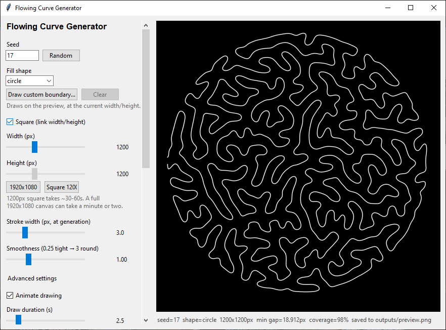
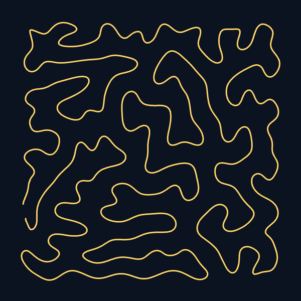
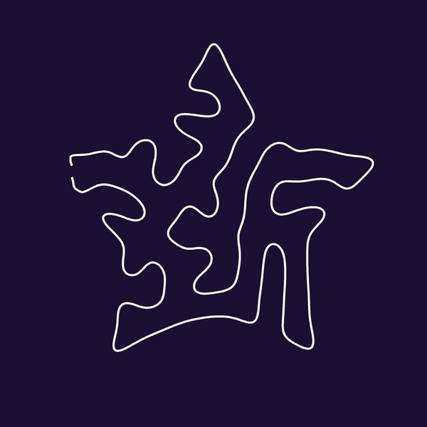

# Flowing Curve Generator

Draws a single, continuous, non-intersecting organic line that fills a shape from edge to edge,
like one long strand of string laid down by hand. Pick a shape (or draw your own), tune how it
flows, and export it as a PNG, an SVG, or a pen-plotter-ready SVG. There's also a looping
"color crawl" animation you can run as a live wallpaper or screen saver on Windows.

It's a desktop app written in Python (Tkinter) for Windows, macOS, and Linux.



| Square fill | Star fill | Color crawl |
| --- | --- | --- |
|  |  |  |

## Features

- **Fill shapes:** square, circle, triangle, diamond, pentagon, hexagon, octagon, star, or draw your own boundary freehand.
- **Any canvas size:** from square to widescreen (a 1920x1080 preset is built in), filled edge to edge with no cropping.
- **Draw-in animation:** watch the curve get traced stroke by stroke.
- **Color crawl:** three customizable colors chase down the curve, with adjustable size, gap, speed, and blend.
- **Export:** PNG or SVG, plus a pen-plotter SVG sized in real millimeters.
- **Live wallpaper (Windows):** runs the color crawl on your desktop and rotates through presets.
- **Screen saver (Windows):** the same rotation as a real screen saver, built and installed from inside the app.

## Install

You need [Python 3.10 or newer](https://www.python.org/downloads/) first (on Windows, tick "Add python.exe to PATH").
The installer then downloads the project, sets up a virtual environment, installs the dependencies, and opens the app.

- **Windows:** download [`install.bat`](https://shane-stevens-git.github.io/Curvy_Line/install.bat) and double-click it.
- **macOS / Linux:** download [`install.sh`](https://shane-stevens-git.github.io/Curvy_Line/install.sh), then run `chmod +x install.sh && ./install.sh`.

Everything runs locally, and nothing you generate leaves your machine.

### Already cloned the repo?

Run `run.bat` (Windows) or `./run.sh` (macOS / Linux). The first run sets up the environment. Or do it by hand:

```
python -m venv .venv
.venv\Scripts\activate        # macOS / Linux: source .venv/bin/activate
pip install -r requirements.txt
python gui.py
```

On Linux, if Tkinter is missing, install it (for example `sudo apt install python3-tk`).

## What's in the repo

- `organic_curve.py`: the algorithm that grows the curve.
- `gui.py`: the desktop app.
- `wallpaper_engine.py` and `screensaver.py`: the Windows live wallpaper and screen saver.
- `index.html`: a project page with the same install steps.
- `FUTURE_IDEAS.md`: notes on ideas and what's done.
